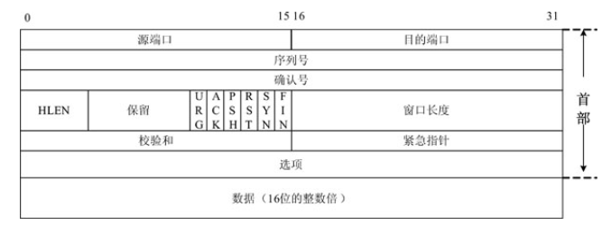

### TCP段格式

1．源端口（Source Port）和目的端口（Destination Port）
2．序列号（Sequence Number）：定义数据段中的数据部分在发送方数据流中的位置
3．确认号（Acknowledgment Number）：定义报文段的接收方期望从对方接收的序列号
4．首部长度（Header length）：以字节为单位表示TCP首部的大小，这个字段的值可以在5（5×4=20）至15（1×4=60）之间，即首部长度可以在20～60字节之间
5．标志（Flags）：定义6种不同的控制位或标志位，这些标志位用在TCP的流量控制、连接建立和终止以及数据传送方式等方面
6．窗口大小（Window size）：指明TCP接收方缓冲区的长度
7．校验和（Checksum）：校验和用于传输层差错检测，允许目的主机可以验证TCP段的内容并能够测试可能的破坏
8．紧急指针（Urgent Pointer）：只有当紧急标志置位（值为1）时，这个字段才有效，这时的报文段中包括紧急数据；如果URG指针被设置，接收方必须检查这个字段；紧急指针所指向的一段数据不必等待缓冲数据的积累，直接发送到对方
9．选项（Options）：

### TCP可靠性————差错控制

TCP的差错控制包括检测损坏的报文段、丢失的报文段、失序的报文段和重复的报文段，并进行纠正。应用程序将数据流交付给TCP后，就依靠TCP将整个数据流按序且没有损坏、没有部分丢失、没有重复地交付给另一端的应用程序。TCP中的差错检测和差错纠正的方法有校验和、确认和重传。

**校验和** 每一个报文段都包括校验和字段，用来检查受损的报文段。
**确认** TCP采用确认来证实收到了报文段，控制报文段不携带数据，但消耗一个序列号。控制报文段也需要被确认。只有ACK报文段永远不需要被确认。
**重传** 差错控制机制的核心就是报文段的重传。当一个报文段损坏、丢失或者被延迟了，就要重传。目前的TCP实现中，有以下两种报文段重传机制。
* 超时重传
* 快重传

**失序报文段的处置** 当一个报文段推迟到达、丢失或被丢弃，在这个报文段后面的几个报文段就是失序到达。现在大多数的实现是不丢弃这些失序的报文段，而是把这些报文段暂时存储下来，并把它们标志为失序报文段，直到丢失的报文段到达。
**重复报文段的处置** 重复的报文段一般是由超时重传造成的，接收方可以根据序列号判断是否是重复报文段，对于重复报文段只需要简单丢弃即可。
**选择确认（SACK）** 现在一些新的TCP实现中支持选择确认（SACK），报告失序和重复的报文段，将其作为TCP首部选项字段的一部分。

### TCP可靠性————流量控制

TCP在传输层上实现端到端的流量控制，为接收方对发送方发送数据进行控制，以避免大量的数据导致接收方瘫痪，这是通过滑动窗口机制来实现的。

#### 1．滑动窗口机制

发送方与接收方各自维护一个缓冲区，在缓冲区（暂时存放从应用程字传出并准备发送的数据）上使用滑动窗口，接收方将当前窗口大小通告给发送方（利用TCP报文段首部的窗口大小字段），发送方根据接收窗口调整其发送窗口，使发送窗口始终小于或等于接收窗口的大小。只有在接收窗口滑动时（与此同时也发送了确认），发送窗口才有可能滑动。收发双方的窗口按照以上规律不断地向前滑动，因此这种协议又称为**滑动窗口协议**。

当发送窗口和接收窗口的大小都等于1时，每发送一个字节的数据都要等待对方的确认，这就是**停止等待协议**。当发送窗口大于1，接收窗口等于1时，就是**回退N步协议**。当发送窗口和接收窗口的大小均大于1时，就是**选择重发协议**。协议中规定窗口内未经确认的分组需要重发。这种分组的数量最多可以等于发送窗口的大小，即滑动窗口的大小n减去1（因为发送窗口不可能大于（n-1），起码接收窗口要大于等于1）。

TCP的窗口以字节为单位进行调整，以适应接收方的处理能力。处理过程如下。
* （1）TCP连接阶段，双方协商窗口大小，同时接收方预留数据缓存区；
* （2）发送方根据协商的结果，发送符合窗口大小的数据字节流，并等待对方的确认；
* （3）发送方根据确认信息，改变窗口大小，增加或者减少发送未得到确认的字节流中的字节数。如果出现发送拥塞，发送窗口缩小为原来的一半，同时将超时重传的时间间隔扩大一倍。

#### 2．发送方产生的糊涂窗口综合症

如果发送方TCP为生产数据很慢的应用程序服务，就可能产生糊涂窗口综合症。解决的方法是防止发送方TCP逐个字节地发送数据，强迫发送方TCP等待，凑成大块数据再发送。为了使TCP等待的时间更为合理，采用了Nagle算法，如果应用程序比网络更快，则报文段就较大（最大长度报文段）。若应用程序比网络慢，则报文段就较小（小于最大长度报文段）。

#### 3．接收方产生的糊涂窗口综合症

如果接收方TCP为消耗数据很慢的应用程序服务，就可能产生糊涂窗口综合症。当接收缓冲区已满，通知窗口大小为0，发送方必须停止发送数据。

针对这种情形，有两种解决方法。

* （1）延迟通告（Delayed Advertisement）

延迟通告又称Clark法，只要有数据到达就发送确认，但在缓冲区已有足够大的空间放入最大长度报文段（Maximum Sized Segment, MSS）之前，或者缓冲区空闲空间达到一半之前，一直都宣布窗口值为0。

* （2）推迟确认（Delayed Acknowledgement）

当报文段到达时并不立即发送确认。接收方在对收到的报文段进行确认之前一直等待，直到输入缓冲区有足够的空间为止。推迟发送确认防止了发送方TCP滑动它的窗口。当发送端TCP发送完数据后就停下来了。推迟确认还有另一个优点，就是减少了通信量，不需要对每一个报文段进行确认。不过推迟确认有可能迫使发送方重传它未被确认的报文段，为此推迟确认设置不能超过500ms。

##### 提示

滑动窗口机制为端到端设备间的数据传输提供了可靠的流量控制机制。然而，它只能在源端设备和目的端设备起作用，当网络中间设备（如路由器等）发生拥塞时，滑动窗口机制将不起作用。

### TCP可靠性————拥塞控制

流量控制是由于接收方不能及时处理数据而引发的控制机制，**拥塞**（Congestion，又译为阻塞）是由于网络中的路由器超载而引起的严重延迟现象。

